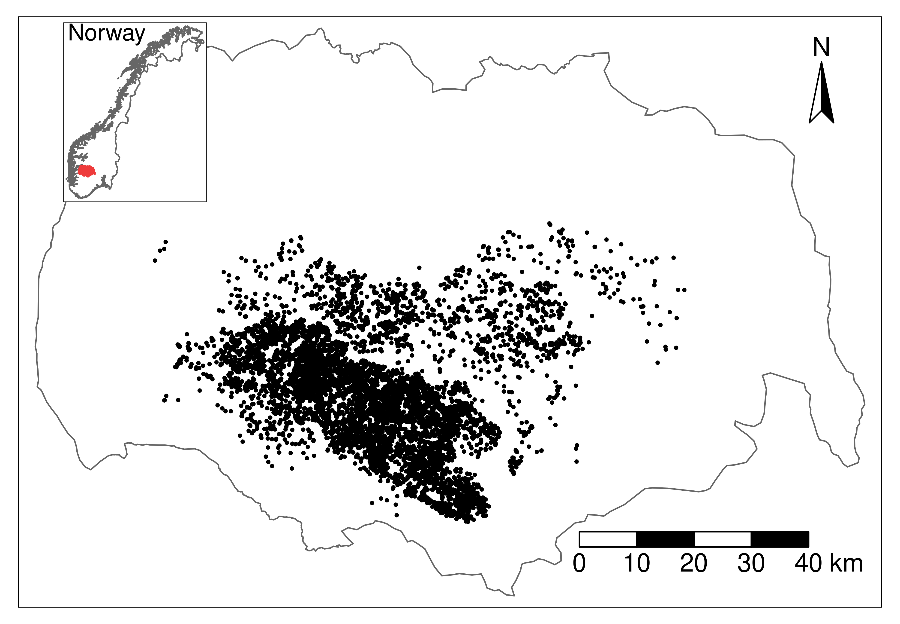

```{r setup, include=FALSE}
knitr::opts_chunk$set(echo = TRUE)
```

# Intro

**Add something introducing the idea of penalized regression in this context**

Here we reanalyze the resource selection function fitted to reindeer movement data from the Hardangervidda 
wild reindeer population, used in Niebuhr et al. 2023 to estimate the zone of influence (ZOI) and the 
cumulative impacts of tourism infrastructure on reindeer habitat selection during summer.

The data comprises GPS positions from 115 female reindeer, recorded with a 3h fix rate. 
The data was put into a use-availabililty design, with 1 used location for each 9 random 
locations distributed over the limits of the wild reindeer area. The data was intersected 
with environmental variables on land cover, four PCAs representing bio-geo-climatic variation, 
and (**the ZOI of the nearest infrastructure and** **remove from this tutorial**) 
the cumulative ZOI of infrastructure types. 
The infrastructures considered were private cottages and public tourist resorts. More information 
about the cumulative ZOI approach, the data collection, and the data preparation for analysis might 
be found in Niebuhr et al. 2023.



Here we show the workflow for preparing the data, fitting a conditional logistic regression model to it, 
and checking model fits combining bootstrap aggregation (bagging) and penalized regression. In a bootstrap
aggregation setup, the model is repeatedly fitted to a subset of the full data set and model fits 
are aggregated into a bag (a group of models). Each model model is based on a different sub-set (a 
resample) of the full data set, allowing variation among them and the estimation of uncertainty on
the model parameters. The penalized regression approach
allows us to perform model fitting and variable selection within the same procedure.
For each resample the data is split into a fitting/train set, used to fit the individual model 
with multiple possible penalty parameters, and a tuning/test set, 
used to calibrate the model, i.e. to select the most parsimonious penalty parameter, 
used then to determine the best fitted model. 

Penalized regression might be fitted using different approaches, such as Ridge, Lasso,
and Adaptive Lasso. Ridge regression shrinks the parameters toward zero, but still keep
all of them in the final fitted model. Lasso (and Adaptive Lasso) allow for variable selection
as well, potentially removing unimportant variables from the fitted model. Adaptive
Lasso allows for different coefficients being penalized differently and is therefore
more flexible than Ridge and Lasso. 
The `oneimpact` package offers different "flavors" of Adaptive Lasso,
by allowing different ways to set the prior penalties to the different ZOI and non-ZOI
variables.
For the purpose of this vignette, we exemplify the approach through Adaptive Lasso regression.

# Preparing the data and the model

We start by loading the packages and the annotated data, already prepared for analysis. 
For details on the preparation of biological and environmental/zone of influence data and 
data annotation workflow, please check Niebuhr et al. 2023.

```{r load_data}
# load packages
library(glmnet) # for fitting
library(ggplot2) # for plotting
library(tmap) # for plotting maps
library(terra) # for spatial predictions

library(oneimpact)

# load data
data("reindeer_rsf")
# rename it just for convenience
dat <- reindeer_rsf

# explore columns
colnames(dat)
```

The data set "reindeer_rsf" in the `oneimpact` package contains the wild reindeer data used to fit the 
resource selection functions using the cumulative ZOI approach in Niebuhr et al. 2023. The response variable 
`use` is a binary variable showing whether a given location was used (1) or not (0, a random location within the 
population area). The used and available positions were annotated with information on land cover 
(column `NORUTreclass`), bio-geo-climatic PCAs (columns `norway_pca_klima_axis` 1 to 4) and the zone of 
influence of private cottages and public resorts (columns starting with `private_cabins` and 
`public_cabins_high`, respectively). Zone of influence variables include both the ZOI of the nearest feature 
and the cumulative ZOI, with radii from 100 m to 20 km. For illustration, we only kept ZOI variables 
with exponential decay shape and cumulative type (not nearest).

The predictor variables are not standardized, but it is essential to standardize them for penalized regression.
The standardization can be done in advance or directly within the model fitting procedure (as we do it here).

## Model specification

We start by defining the structure of the model to be fitted - the `formula`, in R terminology. 
To do that, we make use of the function `oneimpact::add_zoi_formula()` to make it easier to add 
the ZOI metrics with multiple radii in the formula.

```{r model_specification}
# formula initial structure
f <- use ~ private_cabins_XXX + public_cabins_high_XXX +
  NORUTreclass +
  # poly(norway_pca_klima_axis1, 2, raw = TRUE) + 
  # poly(norway_pca_klima_axis2, 2, raw = TRUE) +
  norway_pca_klima_axis1 + norway_pca_klima_axis1_sq +
  norway_pca_klima_axis2 + norway_pca_klima_axis2_sq +
  norway_pca_klima_axis3 + norway_pca_klima_axis4

# add ZOI terms to the formula
zois <- c(100, 250, 500, 1000, 2500, 5000, 10000, 20000)
ff <- add_zoi_formula(f, zoi_radius = zois, pattern = "XXX", 
                      type = c("cumulative_exp_decay"),
                      separator = "", predictor_table = TRUE)

# get formula
f <- ff$formula
# predictor_table for usage later to map ZOI-like type variables
predictor_table_zoi <- ff$predictor_table
```

Contrary to the traditional sub-set modeling approaches, in which only one ZOI predictor with a specific radius
is kept in the model at a time and multiple models are fitted and compared, here we keep all the terms in 
the formula and use a penalized regression approach to both fit the model and select the variables.

```{r formula}
f
```

The `add_zoi_formula()` function can also produce a `predictor_table` `data.frame`, which specifies 
characteristics of the covariates in the model - e.g. whether they are ZOI metrics or not, 
which type (cumulative, nearest), and which radii. This is helpful to treat the ZOI variables 
differently in the model interpretation, to aggregate ZOI terms related to the same 
type of infrastructure, and also to define the term penalties in the different flavors of 
"Adaptive Lasso" approaches.

Here we take a glance on the structure of this table:

```{r predictor_table}
head(predictor_table_zoi, 10)
```

## Setting samples

As in several machine learning workflows, we partition the data into sets used to fit 
(or train) the model, calibrate (or tune/test), and validate. Here this is done within a bootstrap aggregation 
(bagging) procedure, so in general only part of the data is used at a time. We use the function 
`oneimpact::create_resamples()` for this purpose, where we define the number of times we'll resample 
(i.e., the size of the bag, parameter `times`) and the proportion of the data observations that goes 
into fitting, calibration, and validation (parameter `p`) in each resample. 
For simplicity, we perform random sampling here, but the sampling can also be spatially stratified. 

```{r samples}
# sampling - random sampling
set.seed(1234)
samples <- create_resamples(y = dat$use,
                            p = c(0.2, 0.2, 0.2),
                            times = 50,
                            colH0 = NULL)
```

When there is no spatial stratification, the object `samples` is a list of three elements: 
a list of sets (defined by the row numbers in the original data set) that will be used for 
(i) model fitting (`samples$train`), for (ii) variable selection/calibration (`samples$test`), 
and for (iii) model validation (`samples$validate`).

```{r samples2}
str(samples, max.level = 1)
```

# Fitting the model

To fit one single model (e.g. the one corresponding to the first resample above) using 
logistic penalized regression, we can use the function `oneimpact::fit_net_logit()` which calls 
`glmnet::glmnet()` for the fitting procedure. We give an example below. By default, a 
Lasso fit is performed, but the `method` parameter might be used to change it for a 
Ridge or Adaptive Lasso regression. Notice that observations with missing values in the data 
resamples need to be removed before fitting, so the actual number of observations used for 
fitting, calibration, and validation might be actually smaller than it was set. 
A warning message is printed in these cases; but we recommend that missing data is checked
in advance.

```{r fit1model}
# dat2 <- dat
# dat$public_cabins_high_cumulative_exp_decay_1000 <- 0
mod <- fit_net_logit(f, 
                     data = dat,
                     samples = samples, 
                     i = 1, 
                     metric = "AUC",
                     method = "AdaptiveLasso")#,
                     # upper.limits = c(rep(0, 16), rep(Inf, 21)))
```

We will just examine the structure of the output object now. It comprises a list with:

- `parms`: The initial parameters used for when calling `fit_net_logit()`;
- `glmnet_fit`: The actual output from `glmnet`, a set of models with different penalty parameters;
- `metrics_evaluated`: The names of the metrics evaluated for setting the penalty 
parameter `lambda`, set by the `metrics_evaluated` argument when calling `fit_net_logit()`; 
by default the only one is `"AUC"`;
- `var_names`: The names of the variables included in the model formula;
- `numeric_covs`: A vector of logical values for whether each of the covariates
is numeric or not;
- `covariate_mean_sd`: A matrix with the mean and standard deviation for each of 
the covariates in the model, useful for standardizing or unstandardizing covariates
and coefficients;
- `metric`: The name of the metric selected for model validation, here `"AUC"`;
- `lambda`: The final penalty parameter `lambda` selected for the best fitted model;
- `coef`: The coefficients for the variables in the fitted model;
- `train_score`: The score of the model (i.e., the result of the `metric` when applied to) for the 
train/fitting set;
- `train_score`: The score of the model (i.e., the result of the `metric` when applied to) for the 
test/calibration set;
- `validation_score`: The score of the model (i.e., the result of the `metric` when applied to) for the 
validation set. If there is a hierarchical block H0 for block cross validation (e.g. 
representing the populations, study areas, or years; see parameter `H0`
in the functions `spat_strat()` and `create_resamples()`), this is computed for each
block H0;
- `validation_score_avg`: Average of the validation scores across block H0, when they are present.
- `lambdas`: The different penalty parameters selected for each of the `metrics_evaluated`,
when there is more than one metric;
- `coefs_all`, `train_score_all`, `test_score_all`, `validation_score_all`: The same as `coef`, 
`train_score`, `test_score`, and `validation_score`, but for all the `metrics_evaluated`, 
when there is more than one metric.

```{r 1model}
str(mod, max.level = 1)
```

Here the model was calibrated and evaluated using the Area Under the ROC curve, AUC.

However, in this approach we are interested not only in one single model, but in bootstrapping from the whole data set 
and producing a bag of models. In this case, we can use the function `oneimpact::bag_fit_net_logit()` 
which fits all the models and produces a list with all the outputs. After fitting, the function 
`oneimpact::bag_models()` can be used to organize the output of each model in a single "bag" object, 
of the class `bag`.

Running the bag of models below can take some minutes, and the running time can be high for 
larger data sets and more complex models. The model fitting can be done in parallel, and also
saved in external files if needed.

```{r bag_of_models, warning=FALSE}
# fit multiple models
fittedl <- bag_fit_net_logit(f, dat,
                             samples = samples,
                             standardize = "internal", # glmnet does the standardization of covariates
                             metric = "AUC",
                             method = "AdaptiveLasso",
                             parallel = "mclapply",
                             # upper.limits = c(rep(0, 16), rep(Inf, 21)),
                             mc.cores = 8)

# bag models in a single object
bag_object <- bag_models(fittedl, dat, score_threshold = 0.7, 
                          weights_function = w_strech_max_squared)
```

The resulting bag of models is a list which includes the number of models fitted `n`, 
the original formula fitted (`formula`), the fitting method (`method`) and validation metric (`metric`), 
a matrix of coefficients (`coef`) and the fitting, calibration, and validation scores 
(`validation_score`) for all models.

The function `bag_models()` also transforms the validation scores into weights, so that the coefficients 
of each model might be weighted according to how well they fit the data. Models with a validation 
score below a certain threshold (parameter `score_threshold`) are set to weight zero and ignored in
the final bag; the other models' weights 
are transformed and normalized (to sum 1) according to any standard or user-defined function 
(set by the parameter `weights_function`). As a consequence, a number of objects related to the 
weights and the weighted validation scores is also present in the bag object, as well as summaries 
of the data that are useful for model prediction.

```{r look_bag}
str(bag_object, max.level = 1)
```

Here we have two sets of functions important for defining the bag of models. The first function 
(defined by the parameter `score2weight`) defines how 
validation scores are transformed into weights (e.g. mean of scores for `score2weight_mean` and `score2weight_min_mean`)
and also which criterion is used to set weights to zero (e.g. models with average score below the threshold are 
set to weight 0 for `score2weight_mean`, but models with minimum score below the threshold are set to weight
zero for `score2weight_min_mean`).

The second function is defined by the parameter `weights_function` and defines how the 
weights > 0 are normalized and stretched to sum 1. 

# Interpreting the model

Once the model was fit, a number of diagnostics and plots can be used to understand the model fit.

## Model validation

First, it is possible to check and plot the validation scores to know how well the model performs
under new conditions.

```{r model_validation1}
bag_object$validation_score[1:10]
```

In this example, all the models of the bag have a quite good (and equivalent) performance,
with an average weighted validation AUC of `r round(bag_object$weighted_validation_score[1], 3).
Here we go beyond just averaging the scores, but we also account for the weights
of each model, with more weight for models better ranked. We can also plot the 
scores for each model in the bag:

```{r, fig.cap="Histogram of validation scores for the bag of fitted models. The red line shows the threshold for excluding low scoring models. In this example, all models performed well and were kept in the bag."}
hist(bag_object$validation_score, xlim = c(0,1),
     xlab = "Validation score")
abline(v = 0.7, col = "red") # threshold
```

## Variable importance

Variable importance helps us understand the effect size of the different covariates included
in the model by evaluating how strongly one or more variables affect the predicted output of the
model. Variable importance values are proportional to the standardized coefficients 
of the covariates (see Supplementary Material),
but they have the advantage that variables can be grouped; for instance, ZOI of an infrastructure type
at different radii or variables related to the same type of disturbance (e.g. trails and tourist cabins)
can be grouped for an assessment of the importance of multiple variables altogether.

Variable importance is computed here by the function `oneimpact::variable_importance()` by dropping 
certain terms in the model (parameter `type = "drop"`), recomputing the validation score, and comparing it to 
the validation score of the full model. The greater the difference in scores, the largest is the 
importance set to a certain variable or set of variables. This can also be done through permutation 
of the values of each variable or term (parameter `type = "permutation"`), even though the result
in theoretically the same, up to a constant (see Supplementary Material).

Variable importance can be visualized using the function `oneimpact::plot_importance()`.

```{r variable_importance1}
# variable importance
importance <- variable_importance(bag_object, 
                                  data = dat, 
                                  type = "drop", # method = drop variable
                                  order = "asc") # ascendent order

#plot_importance(importance)
plot_importance(importance, remove_threshold = 5e-3) # remove vars with too low score from plot
```

Variable importance might also be computed for groups of variables. For instance, below we group all variables 
with similar ZOI metric (private cottages or public resorts) and all terms related to the same variable (e.g. quadratic terms).

```{r variable_importance2, eval=TRUE}
# Using variable block/type of variable
variable_blocks <- bag_object$var_names |>
  strsplit(split = "_cumulative_exp_decay|reclass|, 2)|, 2, raw = TRUE)|_sq") |>
  sapply(function(x) x[1]) |>
  sub(pattern = "poly(", replacement = "", fixed = TRUE)
variable_blocks
```

```{r variable_importance3, eval=TRUE}
importance_block <- variable_importance(bag_object, 
                                        data = dat, 
                                        type = "drop",
                                        order = "asc",
                                        variable_block = variable_blocks)
plot_importance(importance_block, normalize = T)
```

**Add interpretation here**

## Model coefficients

The estimated coefficients from the models in the bag can be seen in the `coef`
element of the bag. It contains the coefficient of each model/resample of the bag,
for each term of the formula: 

```{r coef1}
# coefficients - already unstandardized by the fit_net_logit function
bag_object$coef[,1:5] |> 
  head(10)
```

What is really going to be used for prediction, however, are the weighted coefficients. 
To understand that, it is important to understand that the model weights in the bag are 
defined based on the validation scores, and they balance the contribution of the coefficients 
of each model. Below we see the validation scores and weights. We see that all models
perform relatively well, which means all of them are given a relative similar weight:

```{r coef3}
# weights and weighted coefficients
bag_object$validation_score[1:10]
bag_object$weights[1:10]
```

Now we can get the weighted coefficients for each model, and averaged over models.

```{r coef4}
# weighted coefficients for each model
bag_object$wcoef[,1:2]
# weighted average coefficients
bag_object$coef %*% bag_object$weights # weighted average
```

Finally, we can plot the coefficients in each model in different ways using the `oneimpact::plot_coef()` function.

**explain one by one**

```{r coef5}
# plot weighted coefficients in each model, for all terms
# plot_coef(bag_object)

# different plots

# only for private cabins, by resample, as bars
# for all resamples
# plot_coef(bag_object, terms = "private_cabins_cumulative")
# for one the 3 first models
plot_coef(bag_object, terms = "private_cabins_cumulative", models = 1:3)
# only for private cabins, by resample, as points
plot_coef(bag_object, terms = "private_cabins_cumulative", 
          plot_type = "points", models = 1:3)
# only for private cabins, as histograms
plot_coef(bag_object, terms = "private_cabins_cumulative", 
          plot_type = "histogram")

```

It is possible to see that several of the terms/covariates were removed from the models
in some of the resamples, i.e., their estimated coefficients were zero. That is a property
of Lasso and Adaptive Lasso regression, that performs variable selection with model
fitting.

We can also plot the raw or weighted average coefficients. This can be done for all
terms, or for terms of one specific type of variable. In this case, for ZOI variables,
it is advisable to order them according to the ZOI radius with the option
`order_zoi_radius = TRUE`.

```{r coef6}
# plot weighted average coefs - all terms
plot_coef(bag_object, what = "average")

# plot weighted average coefs - public cabins
plot_coef(bag_object, what = "average", terms = "public_cabins", 
          plot_type = "points", order_zoi_radius = TRUE)
# zoom
plot_coef(bag_object, what = "average", terms = "public_cabins", 
          plot_type = "points", order_zoi_radius = TRUE) + ylim(-50, 50)
```

## Plot the effect of each predictor on the response variable

We can now plot the response variables one at a time with the `oneimpact::plot_response` function. 
For that, we fix all variables at their median values (or mean, or set them to zero; this is 
controlled by the `baseline` parameter) and vary only one or a few at a time.

### PCA1 - continentality

We start by plotting the effect of PCA 1, which is related to a gradient of continentality. 
The red line below shows the average weighted 
predicted value for the relative selection strength (in the y axis), which is proportional 
to the probability of presence of the species. The black line represents the weighted median 
predicted value, and the grey stripe is the 75% weighted confidence interval, also called
the wighted interquartile range. Given the logistic structure of the habitat selection model we ran, 
we make the prediction with the argument `type = "logit"` to make a logit 
transformation before predicting. In this scale, we should interpret values higher than
0.5 as selection, and values lower than 0.5 as avoidance. However, the variable responses are
more easily interpreted as the gradient of change in relative selection 
as the variable increases or decreases.

```{r plot_response}
# plot responses

# PCA1
wQ_probs=c(0.25, 0.5, 0.75) # percentiles for the median and confidence interval
dfvar = data.frame(norway_pca_klima_axis1 = seq(min(bag_object$data_summary$norway_pca_klima_axis1),
                                                max(bag_object$data_summary$norway_pca_klima_axis1),
                                                length.out = 100))
dfvar$norway_pca_klima_axis1_sq = dfvar$norway_pca_klima_axis1**2

# reference median
plot_response(bag_object, 
              dfvar = dfvar, 
              data = dat, 
              type = "exp", ci = TRUE, 
              wq_probs = wQ_probs)
```

An alternative way to represent the variability in the model predictions in the bag
is also to plot the individual model predictions as lines, instead of the 
weighted confidence interval. This is done setting the parameters `individ_pred = TRUE`
and `ci = FALSE`.

```{r plot_response1.2}
# reference median
plot_response(bag_object, 
              dfvar = dfvar, data = dat, 
              type = "exp", 
              indiv_pred = TRUE, 
              ci = FALSE)
```

### PCA3 - terrain ruggedness

Now we plot the effect of PCA3, which is related to terrain ruggedness.

```{r plot_response2}
# plot responses

# PCA3
wQ_probs=c(0.25, 0.5, 0.75)
dfvar = data.frame(norway_pca_klima_axis3 = seq(min(bag_object$data_summary$norway_pca_klima_axis3),
                                                max(bag_object$data_summary$norway_pca_klima_axis3),
                                                length.out = 100))
plot_response(bag_object, 
              dfvar = dfvar, data = dat, 
              type = "logit", 
              ci = FALSE, indiv_pred = TRUE)
```

### Private cabins

Now we plot the effects of the ZOI of private cabins. 
Here the `plot_response()` function gets all the variables that contain "private_cabins" in the name. 
We plot the distance in logarithmic scale to ease the visualization. We start by plotting the
relative selection strength considering the impact of one single private cabin. 

```{r plot_response3, eval=TRUE}
# ZOI private cabins
dfvar = data.frame(private_cabins = 1e3*seq(0.2, 20, length.out = 100))
plot_response(bag_object, 
              dfvar = dfvar, data = dat, 
              type = "logit", zoi = TRUE, 
              ci = FALSE, indiv_pred = TRUE, 
              logx = TRUE, ylim = ggplot2::ylim(0, 1))
```

We see that the effects of a private cabin vary from strong effects up to ca. 2.5km to
very weak effect, depending on the model in the bag. This means that there is a high variation on
the effect size and ZOI of one single private cabin, even though the weighted mean
and median effects are negative.

However, we see that both the realized effect size and the ZOI radius increase as
the density of cabins increase, and the negative effects gets less uncertain. See
below the response plot for a set of 10 and 100 cabins.

```{r plot_response4}
# 10 features
plot_response(bag_object, 
              dfvar = dfvar, data = dat, 
              n_features = 10,
              type = "logit", zoi = TRUE, 
              ci = FALSE, indiv_pred = TRUE, 
              logx = TRUE, ylim = ggplot2::ylim(0, 1))

# 100 features
plot_response(bag_object, 
              dfvar = dfvar, data = dat, 
              type = "logit", zoi = TRUE, 
              n_features = 100,
              ci = FALSE, indiv_pred = TRUE, 
              logx = TRUE, ylim = ggplot2::ylim(0, 1))
```

### Public resorts

Now we plot the response curves for public resorts. We start by plotting the relative 
selection strength considering the impact of one single resort.

```{r plot_response7}
# ZOI public resorts cumulative
dfvar = data.frame(public_cabins = 1e3*seq(0.2, 20, length.out = 100))

# 1 feature
plot_response(bag_object, 
              dfvar = dfvar, data = dat, 
              type = "logit", zoi = TRUE, 
              n_features = 1,
              ci = FALSE, indiv_pred = TRUE, 
              logx = TRUE, ylim = ggplot2::ylim(0, 1))
```

We see a negative impact of a public resort, non-linearly, up to 20 km, with high variation
in the range 100-2500 m, but with overall average and median negative effects. We can also
increase and evaluate the impact of three public resorts in a neighborhood, the maximum
observed in the study area, which shows a more consistently
negative effect which only starts to decrease after 10 km.

```{r plot_response8}
# 3 features
plot_response(bag_object, 
              dfvar = dfvar, data = dat, 
              type = "logit", zoi = TRUE, 
              n_features = 3, 
              ci = FALSE, indiv_pred = TRUE, 
              logx = TRUE, ylim = ggplot2::ylim(0, 1))
```

# Spatial predictions

## Main habitat suitability prediction maps

Now we load the spatial data with the environmental covariates included in the model above -
land cover, the four bio-geo-climatic PCAs, and the different ZOI variables for 
private and public cabins. The data is loaded for the whole study area - 
the Hardangervidda wild reindeer area in Norway and its surroundings.

```{r}
(f <- system.file("raster/rast_predictors_hardanger_500.tif", package = "oneimpact"))
rast_predictors <- terra::rast(f)
```

We can use the function `oneimpact::bag_predict_spat()` to make spatial predictions 
based on the bag of fitted models. It is possible to predict the 
weighted average suitability (if `what = "mean"`), the weighted median suitability
and weighted percentiles of the suitability (if `what = "median"`), to represent its uncertainty, 
and it is also possible to create individual predictions for each model in the bag
(if `what = "ind"`). Below we compute the first two options and start by plotting 
the weighted average habitat suitability, which shows a similar pattern to the habitat suitability
map presented in Niebuhr et al. 2023 (Fig. 5f).

```{r}
pred <- bag_predict_spat(bag = bag_object, data = rast_predictors,
                         input_type = "rast", what = c("mean", "median"))
# if rast_df was a data.frame
# pred <- bag_predict_spat(bag = bag_object, data = rast_df,
#                          gid = "cell", coords = c("x", "y"), 
#                          crs = "epsg:25833")
```

The function produces a list with: 

- `grid`, the data used for prediction  (as a `data.frame`);
- `weights`, the weights of each model in the bag;
- three `SpatRaster` objects, possibly with multiple layers, with the weighted
average prediction, the weighted median prediction (+ measures of uncertainty), and the individual model predictions for the habitat suitability. Which elements are 
returned depend on
the values included in the `what` argument.

Below we plot the first map, the weighted average prediction.

```{r}
# weighted average
map1 <- tmap::tm_shape(pred[["r_weighted_avg_pred"]]) +
  tmap::tm_raster(palette = "Greens", style = "cont", title = "Suitability") +
  tmap::tm_layout(legend.position = c("LEFT", "BOTTOM"),
                  main.title = "Weighted average habitat suitability",
                  main.title.position = c("center"),
                  main.title.size = 1) +
  # tmap::tm_shape(study_area_v) +
  # tmap::tm_borders() +
  tmap::tm_compass()
print(map1)
```

The weighted median suitability also produces a quite similar prediction. It is by default
stored in as the first layer of the raster `pred$r_ind_summ_pred`.

```{r}
# average/SD of individual pred
names(pred[["r_ind_summ_pred"]]) <- c("Median", "IQR", "QCV")
map2 <- tmap::tm_shape(pred[["r_ind_summ_pred"]][[1]]) +
  tmap::tm_raster(palette = "Greens", style = "cont", title = "Suitability") +
  tmap::tm_layout(legend.position = c("LEFT", "BOTTOM"),
                  main.title = "Weighted median habitat suitability",
                  main.title.position = c("center"),
                  main.title.size = 1) +
  # tmap::tm_shape(study_area_v) +
  # tmap::tm_borders() +
  tmap::tm_compass()
print(map2)
```

When the argument `what = "median"` is used in the `bag_predict_spat()` function,
it also allows us to compute measures of uncertainty. The first measure (stored as
the second layer of the `pred$r_ind_summ_pred` raster object) is the range of variation between 
the weighted percentile individual modeled suitabilities. By default, it computes the interquartile range
(IQR, the different between the 25 and 75 weighted predicted percentiles), but other values
might be selected through the argument `uncertainty_quantiles` in the `bag_predict_spat()`
function.

```{r}
map3 <- tmap::tm_shape(pred[["r_ind_summ_pred"]][[2]]) +
  tmap::tm_raster(palette = "Reds", style = "cont", title = "Uncertainty") +
  tmap::tm_layout(legend.position = c("LEFT", "BOTTOM"),
                  main.title = "Interquartile range of the estimated suitability",
                  main.title.position = c("center"),
                  main.title.size = 1) +
  # tmap::tm_shape(study_area_v) +
  # tmap::tm_borders() +
  tmap::tm_compass()
print(map3)
```

We see that the largest absolute variation between individual model predictions is in the areas
with high predicted average/median suitability, which are the areas far away from 
all types of tourist cabins.

The function also computes (by default) the quartile coefficient of variation (QCV), which is
defined as the ratio $QCV = \frac{p_{75} - p_{25}}{p_{75} + p_{25}}$, where $p_x$ is the `x%`
percentile. We see now that this measures highlights the relative (not the absolute)
variation in the prediction, which occurs close to the two types of cabins and in the areas
of high variation in the other predictors as well.

```{r}
map4 <- tmap::tm_shape(pred[["r_ind_summ_pred"]][[3]]) +
  tmap::tm_raster(palette = "Reds", style = "cont", title = "Uncertainty") +
  tmap::tm_layout(legend.position = c("LEFT", "BOTTOM"),
                  main.title = "Quartile coefficient of variation of the estimated suitability",
                  main.title.position = c("center"),
                  main.title.size = 1) +
  # tmap::tm_shape(study_area_v) +
  # tmap::tm_borders() +
  tmap::tm_compass()
print(map4)
```

## Predictor impact maps

We can also predict the impact of each individual covariate alone, by multiplying the covariates
by their respective estimated coefficients. This can be done through the function 
`oneimpact::bag_predict_spat_vars()`. Here, the `predictor_table_zoi` computed above
through the `add_zoi_formula()` function can be used. 

Similarly to the `bag_predict_spat()` function, the `bag_predict_spat_vars()` function
produces a list with:

- `vars`, the names of the variables whose impact was predicted (typically a pattern extracted from
the predictor table, which is similar for the same ZOI variables which change only on radii or for 
variables with linear and quadratic terms, for instance);
- `grid`, a list of data.frames with the variables used for the prediction of each variable response;
- `weights`, the weighted of each model in the bag;
- three elements with the weighted average, median, and individual predictions; each of them consists of a
list of `SpatRaster` objects, one for each variable list in `vars`.

To make it fast, we produce only the mean weighted prediction for the partial
effect of each of the covariates.

```{r}
# variables to be considered
predictor_table_zoi$variable
# correct quadratic terms
predictor_table_zoi$variable <- gsub("poly(", "", predictor_table_zoi$variable, fixed = T) |>
        gsub(pattern = ", 2, raw = TRUE)|_sq", replacement = "")

pred_vars <- bag_predict_spat_vars(bag = bag_object, 
                                   data = rast_predictors,
                                   predictor_table_zoi = predictor_table_zoi, 
                                   prediction_type = "exp",
                                   input_type = "rast", what = c("mean"))

str(pred_vars, max.level = 2)
```

We can start by plotting the expected impact of one of the bio-geo-climatic PCAs (PCA3) and the land cover layer,
as an example. Here, we have plotted the responses in the exponential scale, for simplicity.
This means that values above 1 represent selection, and values below 1 represent avoidance.

```{r}
plots <- lapply(c(3,4,6), 
                function(x) #plot(x, main = names(x), col = map.pal("viridis")))
                  tmap::tm_shape(pred_vars$r_weighted_avg_pred[[x]]) +
              tmap::tm_raster(palette = "PiYG", style = "cont",
                              title = "Effect", breaks = seq(0, 2, 0.1),
                              midpoint = 1) +
              tmap::tm_layout(#legend.position = c("LEFT", "BOTTOM"),
                legend.outside = TRUE,
                main.title = names(pred_vars$vars[x]),#"Weighted average effect of predictors",
                main.title.position = c("center"),
                main.title.size = 1) +
              tmap::tm_compass())
print(plots)
```

We see in these images that the effect of PC1 (continentality) is the largest between
those variables, followed by that of land cover and effect of PCA3 (terrain ruggedness).
We also see that reindeer in summer avoid the lower lands with forests and climates
which are too oceanic (in the West).

We can now plot the spatial impact of private cabins and public cabins. As shown 
above, the effect of both types of infrastructure is very strong.

```{r}
# private cabins
map_plot <- pred_vars$r_weighted_avg_pred[[1]]
map1 <- tmap::tm_shape(map_plot) +
              tmap::tm_raster(palette = "PiYG", style = "cont",
                              title = "Effect", breaks = seq(0, 2, 0.1),
                              midpoint = 1) +
              tmap::tm_layout(#legend.position = c("LEFT", "BOTTOM"),
                legend.outside = TRUE,
                main.title = names(map_plot),#"Weighted average effect of predictors",
                main.title.position = c("center"),
                main.title.size = 1) +
              tmap::tm_compass()
print(map1)

# public cabins
map_plot <- pred_vars$r_weighted_avg_pred[[2]]
map2 <- tmap::tm_shape(map_plot) +
              tmap::tm_raster(palette = "PiYG", style = "cont",
                              title = "Effect", breaks = seq(0, 2, 0.1),
                              midpoint = 1) +
              tmap::tm_layout(
                legend.outside = TRUE,
                main.title = names(map_plot),#"Weighted average effect of predictors",
                main.title.position = c("center"),
                main.title.size = 1) +
              tmap::tm_compass()
print(map2)
```

# Concluding remarks

**Add something here**
