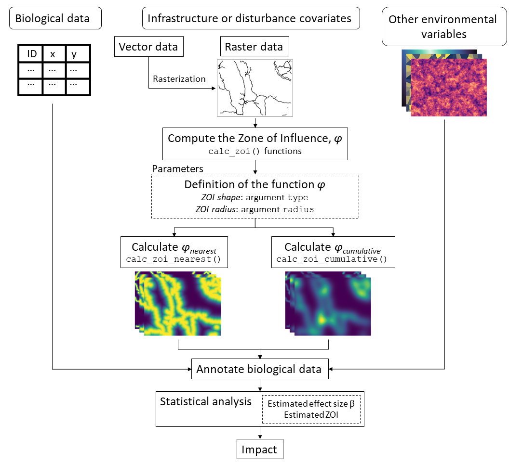

```{r, include = FALSE}
knitr::opts_chunk$set(
  collapse = TRUE,
  comment = "#>"
)
```

# Introduction

Anthropogenic disturbance often takes place in landscapes already affected by 
infrastructure development and land use change, leading to cumulative impacts on biodiversity. Typically, the impact of a given type of infrastructure is determined by computing 
the distance to the nearest feature only, ignoring potential cumulative impacts of 
multiple features, which can lead to severe underestimations. 
The `oneimpact` package is a collection of tools and functions intended to aid 
the estimation of cumulative impacts in ecological studies and environmental 
impact assessments. Its main functions are related to the
calculation of zone of influence (ZoI) metrics based both
on the nearest influence only and the cumulative influence of multiple features
of a given type of infrastructure.
By calculating the ZoI of the nearest feature and the cumulative ZoI of multiple
features using different ZoI shapes and radii, it is possible to use these different
metrics as covariates in ecological models and evaluate how strongly different
infrastructure types affect ecological processes, how their impact spreads in space,
how far they reach, and if the impact of multiple features accumulate.
The approach is described in details in Niebuhr et al. (*submitted*) and 
exemplified in this document.

The discussion around the impacts of anthropogenic disturbance and their zone of
influence is closely linked to the studies on habitat amount and fragmentation 
and the *scale of effect* of spatial variables on species-habitat relationships, 
widely explored in the landscape ecology literature (e.g. Miguet et al., 2016; 
Huais, 2018). For all practical purposes, estimating the ZoI of anthropogenic 
disturbances is similar to estimating their scale of effect while also taking
into account the shape of their influence (i.e. how they are spatially weighted;
Miguet et al., 2017).

Here we give an overview of the functions in `oneimpact`, define and illustrate 
the zone of influence functions, show how to use the main package functions, 
and provide an example of how to use this approach to annotate data for 
statistical analysis.

To install the `oneimpact` package, it is possible to use the 
`devtools::install_github()` function:

```{r install, eval=FALSE}
library(devtools)
devtools::install_github(repo = "NINAnor/oneimpact", ref = "HEAD")
```

Once installed, we now load the `oneimpact` package and other packages used in this
vignette.

```{r load_packages, message=FALSE, warning=FALSE, eval=TRUE, echo=TRUE}
library(oneimpact)

library(ggplot2) # for plots
library(terra) # for spatial processing
library(sf) # for spatial operations with vectors
library(dplyr) # for data wrangling
```

# Overview of the package

The `oneimpact` package has two main functions to calculate zones of influence,
the functions `calc_zoi_nearest()` and `calc_zoi_cumulative()`. Alternatively, the
function `calc_zoi()` can calculate both ZoI metrics in the same run. 
These functions' main arguments are the `type`, which defines the shape of the 
spatial decay of the ZoI, and `radius`, which defines how far the influence
expands in space (or how fast it decreases with distance). 

Both functions can be run in [R environment](https://www.r-project.org/) 
(R Core Team, 2021) and in [GRASS GIS](https://grass.osgeo.org/) 
environment (GRASS Development Team, 2017). 
This is defined by the parameter `where`. On the one hand, computations
in R are generally fast and easy-to-use, since they make use of the optimized 
functions from the `terra` package (Hijmans, 2022). However, computations 
might become slow for large maps. On the other hand, in GRASS GIS, 
it is possible to compute the ZoI for very large maps using the
software's compiled tools, and given that GRASS GIS does not store maps
in the computer's memory. In GRASS GIS, the calculation of the ZoI requires an 
active connection between the R session and a GRASS GIS location and mapset 
(through the package `rgrass7`; Bivand, 2022), and that the input maps are already loaded within 
this GRASS GIS mapset.  Furthermore, in GRASS GIS the function returns only the 
name of the output map. This map is stored in the GRASS GIS location/mapset, 
and might be retrieved to R through the `rgrass::read_RAST()` function
or exported outside GRASS using the [`r.out.gdal`](https://grass.osgeo.org/grass82/manuals/r.out.gdal.html) module, for instance.

The ZoI of the nearest feature (the output of `calc_zoi_nearest()`) is based on 
transformations of the map of distance to the nearest feature. First, this map is 
computed through the `terra::distance()` function in R or 
the [`r.grow.distance`](https://grass.osgeo.org/grass82/manuals/r.grow.distance.html)
module in GRASS. Then, ZoI functions are applied to transform these maps into 
zones of influence. The zone of influence functions implemented in `oneimpact` are
shown in Table 1 and might be explored with the command `help(zoi_functions)`. 
They might also be plotted in 1 dimensional space with the `plot_zoi1d()` function,
for illustration of their behavior.

The cumulative ZoI of multiple features (the output of `calc_zoi_cumulative()`) 
is based on a neighborhood analysis using spatial filters that determine the ZoI
functions. The same ZoI functions might be used in both `calc_zoi_nearest()` 
and `calc_zoi_cumulative()`, accounting
for different ZoI shapes and radii, but in the latter they are used to create 
weight matrices as input for the neighborhood analysis. The function already
has built-in choices for the ZoI functions that determine the weight matrix.
These and other weight matrices might be created through the function 
`filter_create()`.
The function `calc_zoi_cumulative()` computes the neighborhood analysis 
through the `terra::focal()` function in R or through one 
of the tools in GRASS GIS: [`r.mfilter`](https://grass.osgeo.org/grass82/manuals/r.mfilter.html), [`r.resamp.filter`](https://grass.osgeo.org/grass82/manuals/r.resamp.filter.html), or [`r.neighbors`](https://grass.osgeo.org/grass82/manuals/r.neighbors.html). 
The tool to be used might be determined by the user (parameter `module`).

Table 1: Main functions in `oneimpact` used to calculate zones of influence. They are 
divided in three types: zone of influence functions ("ZoI functions"), functions to 
compute the ZoI for raster maps ("Compute ZoI"), and functions to create filters
or weight matrices for use in the computation of the cumulative ZoI ("Create filters").

<center>

| Type of function | Function | Description | Input | Output |
|---|----|------------|---|---|
| ZoI functions | `dist_decay()` \ `threshold_decay()` \ `step_decay()` \ `linear_decay()` \ `bartlett_decay()` \ `tent_decay()` \ `exp_decay()` \ `gaussian_decay()` \ `half_norm_decay()` | These functions compute Zone of Influence (ZoI) decay values. The shape of the zone of influence might be changed through the argument `type` in the generic function `dist_decay()`, or through calling the other specific functions. The functions with different shapes represent multiple ways the ZoI of an infrastructure or disturbance might affect a given process in space, and the ZoI radius (parameter `radius`) controls how far this effect reaches. The rate of decay of the different ZoI functions is parameterized based on the ZoI radius – e.g the slope of `linear_decay()` is defined so that the function decreases to zero at the ZoI radius. These functions can  be used to transform arrays of (Euclidean) distance values (in one dimension)  or rasters of (Euclidean) distance (in two dimensions) into values of a zone of influence. The distance might represent the distance to anthropogenic infrastructure, sources of disturbance, or more broadly any type of land use class or spatial variable. | Vector of distance values or raster of (Euclidean) distance from sources of disturbance; ZoI shape and radius | Vector or raster of ZoI values |
| ZoI functions | `plot_zoi1d()` | This function plots the zone of influence functions in 1 dimensional space, for illustration purposes. When there is more than one value for `points` (the location of infrastructure or sources of disturbance), either the ZoI of the nearest feature or the cumulative ZoI can be plotted. The ZoI of the nearest feature corresponds to the maximum ZoI value from all infrastructure at each position. The cumulative ZoI corresponds to the sum of the ZoI of all infrastructure at each position. | 
| Compute ZoI | `calc_zoi_nearest()` | This function takes in a raster with locations or counts of infrastructure features and calculates a raster representing the zone of influence from the neareast feature of that type of infrastructure. Zones of influence are defined by functions that decay with  the distance from each infrastructure and their rate of decay is controlled by the ZoI radius (parameter `radius`), which defines  how far the influence of an infrastructure feature goes. By default, the Gaussian decay ZoI is calculated, but other  decay functions might be used (parameter `type`). The `calc_zoi_nearest()` function might also return the Euclidean distance to the nearest feature or a transformation from it (e.g. log- and sqrt-distance from the nearest feature). | Raster(s) with location of disturbance sources; ZoI shape and radius | Raster(s) of ZoI of the nearest feature | 
| Compute ZoI | `calc_zoi_cumulative()` | This function takes in a raster with locations or counts of infrastructure features and calculates a raster representing the cumulative zone of influence or the density of features in space. The process is done through a moving window/neighborhood analysis. The ZoI or weight matrix is defined from zone of influence  functions, which might follow different shapes (parameter `type`) and cover an area according to the ZoI radius (parameter `radius`). | Raster(s) with location of disturbance sources; ZoI shape and radius | Raster(s) of the cumulative ZoI of multiple features |
| Compute ZoI | `calc_zoi()` | This function takes in a raster with locations or counts of infrastructure and calculates a raster with either or both zone of influence metrics: the ZoI of the nearest feature and the cumulative ZoI. I.e., `calc_zoi()` can compute both `calc_zoi_nearest` and `calc_zoi_cumulative` in a single run. | Raster(s) with location of disturbance sources; ZoI shape and radius | Raster(s) with either the ZoI of the nearest feature or the cumulative ZoI, or both |
| Create filters | `filter_create()` | This function creates matrices of weights following different functions to be used in neighborhood analyses for rasters. In the context of cumulative impact analysis, they represent the Zone of Influence (ZoI) of each infrastructure point/pixel, to be used to calculate the cumulative ZoI or density of features. | Reference raster; ZoI shape and radius | Weight matrix (or matrices when there is more than one value for the ZoI shape or radius). It can also write the matrices to files using `filter_save` |
| Create filters | `filter_save()` | This function saves a matrix with weights (filter or kernel matrix) in an external text file. It can save either the raw matrix or save a file using the standards for running the [`r.mfilter`](https://grass.osgeo.org/grass82/manuals/r.mfilter.html) algorithm within GRASS GIS. | Matrix of weights | Text file (no output within R) |

</center>


# The concept of zone of influence

The zone of influence (ZoI) is the function $\phi$ that informs how the 
impact of a given infrastructure feature, source of disturbance, or landscape element decreases with distance. 
Formally, the 
ZoI $\phi = f(d, r)$ is any decay function that has a maximum value 
1 where disturbance is located, decreases towards zero as the 
distance $d$ increases, and possibly vanishes at a given point, the ZoI radius $r$. 
Broadly speaking, the ZoI is characterized by its shape and radius. Four sets of 
functions are implemented in `oneimpact`: threshold decay, linear decay, exponential
decay, and Gaussian decay. Some of these functions present the same definition 
with multiple function names, to accommodate how different algorithms call the 
same functions (e.g. `linear_decay()` and `bartlett_decay()` represent the same function).

## ZoI functions

### Functions with a well-defined ZoI radius

Some functions vanish for a certain non-infinite distance and therefore present
well-defined ZoI radii. Here the ZoI radius $r$ represents the distance at which $\phi = 0$.
Two functions of this type are implemented in `oneimpact`: the threshold and the linear
decay functions.

#### Threshold decay function

The threshold function is constant if the distance $d$ to infrastructure or source of
disturbance is smaller than the ZoI radius $r$, and zero beyond that. It can be
computed using the `threshold_decay()` or the `step_decay()` functions:

```{r threshold}
# threshold ZoI with radius = 10
threshold_decay(5, radius = 10) # within the radius
threshold_decay(10, radius = 10) # at or beyond the radius
```

To visualize the function shape in 1 dimension space, we make use of the function
`plot_zoi1d()`. This plot assumes the source of disturbance is located at `x = 0`
and the distance to it increases for both sides in the x axis:

```{r plot_threshold, message=FALSE, error=FALSE, warning=FALSE}
# threshold ZoI with radius = 10
plot_zoi1d(points = 0, radius = 10, fun = threshold_decay, range_plot = c(-20, 20))
```

<!-- fig.cap="Figure 1. Illustration of a threshold decay ZoI with ZoI radius = 10." -->

#### Linear decay function

The linear decay (also Bartlett or tent decay) function decreases linearly with
the distance $d$ to infrastructure or source of
disturbance and becomes zero at and beyond the ZoI radius $r$. It can be
computed using the following functions: `linear_decay()`, `bartlett_decay()`, and `tent_decay()`.
Here we show the use of the function: 

```{r linear}
# linear decay ZoI with radius = 10
linear_decay(5, radius = 10) # within the radius
linear_decay(10, radius = 10) # at or beyond the radius
```

We again visualize the function shape in 1 dimension space using the function
`plot_zoi1d()`:

```{r plot_linear, message=FALSE, error=FALSE, warning=FALSE}
# threshold ZoI with radius = 10
plot_zoi1d(points = 0, radius = 10, fun = linear_decay, range_plot = c(-20, 20))
```

<!-- fig.cap="Figure 2. Illustration of a linear decay ZoI with ZoI radius = 10." -->

### Functions that do not vanish with distance

Some functions decrease but do not vanish as the distance from infrastructure increases.
In these cases we define the ZoI radius $r$ as the distance at which the ZoI decreases
to $\phi = \phi_{limit}$, an arbitrary small ZoI value beyond which the influence
of the infrastructure is considered to be negligible. In these cases, the ZoI
definition needs an extra parameter and is defined as $\phi = f(d, r, \phi_{limit})$.
Two functions of this type are implemented in `oneimpact`: the exponential decay
and the Gaussian decay functions.

#### Exponential decay function

The exponential decay function decays exponentially with
the distance $d$ to infrastructure, and the rate of decay is set so that
$\phi = \phi_{limit}$ at the ZoI radius ($d = r$).
The exponential decay might be calculated using the `exp_decay()` function:

```{r exp}
# exponential decay ZoI with radius = 10
exp_decay(5, radius = 10) # within the radius
exp_decay(10, radius = 10) # at the radius
exp_decay(15, radius = 10) # beyond the radius
```

As it is possible to see, an exponential decay ZoI with `radius = 10` does
not imply the function is null beyond the ZoI radius, but that it goes below
the `zoi_limit`. By default, `zoi_limit = 0.05`, but this value might be changed by
the user (e.g. to 0.01 or other small value). Changing `zoi_limit` changes the
interpretation of the ZoI radius parameter, though:

```{r exp_2}
# changing zoi_limit changes the interpretation of radius
exp_decay(5, radius = 10, zoi_limit = 0.01) # within the radius
exp_decay(10, radius = 10, zoi_limit = 0.01) # at the radius
exp_decay(15, radius = 10, zoi_limit = 0.01) # beyond the radius
```

We visualize the function shape in 1 dimension space:

```{r plot_exp, message=FALSE, error=FALSE, warning=FALSE}
# threshold ZoI with radius = 10
p <- plot_zoi1d(points = 0, radius = 10, fun = exp_decay, range_plot = c(-20, 20)) +
  geom_hline(yintercept = 0.05, linetype = 2, color = "grey") +
  geom_vline(xintercept = c(-10, 10), linetype = 2, color = "grey")

p
```

<!-- fig.cap="Figure 3. Illustration of an exponential decay ZoI with ZoI radius = 10 and ZoI limit = 0.05." -->

We add to the plot a horizontal dashed line at `zoi_limit = 0.05` and vertical dashed
lines at `x = 10` and `x = -10` (since `radius = 10`), to show that the ZoI radius
represents the distance where the ZoI reaches `zoi_limit`.

#### Gaussian decay function

The Gaussian (or half-normal) decay function decays following a half normal shape,
and the rate of decay is set so that  $\phi = \phi_{limit}$ at the ZoI radius ($d = r$).
The Gaussian decay might be calculated using the `gaussian_decay()` and
`half_norm_decay()` functions:

```{r gauss}
# Gaussian decay ZoI with radius = 10
gaussian_decay(5, radius = 10) # within the radius
gaussian_decay(10, radius = 10) # at or beyond the radius
gaussian_decay(15, radius = 10) # at or beyond the radius
```

We visualize the function shape in 1 dimension space:

```{r plot_gauss, message=FALSE, error=FALSE, warning=FALSE}
# threshold ZoI with radius = 10
p <- plot_zoi1d(points = 0, radius = 10, fun = gaussian_decay, range_plot = c(-20, 20)) +
  geom_hline(yintercept = 0.05, linetype = 2, color = "grey") +
  geom_vline(xintercept = c(-10, 10), linetype = 2, color = "grey")

p
```

<!-- fig.cap="Figure 4. Illustration of a Gaussian decay ZoI with ZoI radius = 10 and ZoI limit = 0.05." -->

Notice that, even though the ZoI radius $r$ is defined for all the
functions, the change in their shape strongly modifies the interpretation of how
the ZoI changes with distance. These functions set here might be used to calculate
the ZoI of nearest feature or to define weight matrices and calculate the cumulative
ZoI of multiple features. Alternatively, the generic function `dist_decay()` can
accomodate all these shapes by using the argument `type`. For instance, to compute
the ZoI of a disturbance source following a linear decay shape with radius of 6,
one can use `linear_decay(x = 0, radius = 6)` or 
`dist_decay(x = 0, radius = 6, type = "linear")`.

## ZoI metrics

Given a ZoI function was set with a specific shape and ZoI radius and there is more than
one infrastructure feature or source of disturbance in space, two metrics
might be calculated for the zone of influence: the ZoI of the nearest feature alone and the cumulative ZoI of multiple features.

To exemplify their difference, we illustrate them using a Gaussian decay ZoI
in 1 dimension space using the `plot_zoi1d()` function.
We set four sources of disturbance
(e.g. houses) located at `x = 0`, `x = 2`, `x = 8`, and `x = 12`, and set the
ZoI radius of each feature as `radius = 3`. We start by plotting 
the ZoI of the nearest feature alone by setting `zoi_metric = "nearest"`:

```{r zoi_metrics_near}
disturbance_locations <- c(0, 2, 8, 12)
p <- plot_zoi1d(points = disturbance_locations, radius = 3, fun = gaussian_decay,
           zoi_metric = "nearest", range_plot = c(-10, 20)) +
  labs(x = "Space") +
  ylim(0, 1.5) +
  geom_vline(xintercept = disturbance_locations, linetype = 2, color = "grey")

print(p)
```

<!-- fig.cap="Figure 5. Metric of ZoI of the neareast feature for multiple sources of disturbance illustrated in 1 dimension using a Gaussian decay ZoI with radius = 3." -->

The location of the disturbance sources is shown by the vertical dashed lines. Notice that the
the maximum value for the ZoI of the nearest feature is 1.

Now we do the same but considering that the ZoI of each feature accumulates. We do it by
setting `zoi_metric = "cumulative"` in `plot_zoi1d()`:

```{r zoi_metrics_cum}
p <- plot_zoi1d(points = disturbance_locations, radius = 3, fun = gaussian_decay,
           zoi_metric = "cumulative", range_plot = c(-10, 20)) +
  labs(x = "Space") +
  ylim(0, 1.5) +
  geom_vline(xintercept = disturbance_locations, linetype = 2, color = "grey")

p
```

<!-- fig.cap="Figure 6. Metric of cumulative ZoI for multiple sources of disturbance illustrated in 1 dimension using a Gaussian decay ZoI with radius = 3."} -->

Notice that the the maximum value for the cumulative ZoI of multiple features might be higher
than 1 where the ZoI of different features overlap.

# Calculating the ZoI metrics for rasters

## Define the input raster map

To calculate the ZoI metrics for 2 dimensional raster objects, we use the functions
`calc_zoi_nearest()` and `calc_zoi_cumulative()`. To give an example, we present a 
data set with the
location of private cabins in Norway, subset for a small sample region in Southern Norway.
The data is mapped as points in vector format; more information about it might be
found using the command `help(cabins_sample.gpkg)`. We read the vector file using the
package `terra`:

```{r read_vect, fig.cap="Location of private cabins in a study area in Souther Norway."}
# file path
s <- system.file("vector/sample_area_cabins.gpkg", package = "oneimpact")
# read file
cabins_vect <- terra::vect(s)
# check
cabins_vect
# plot
plot(cabins_vect, cex = 0.5)
```

If the input map is already in raster format, it can be used directly in the `calc_zoi_*()`
functions. In our case, since it is in vector format, it must be rasterized first.
For many types of anthropogenic infrastructure or disturbance which are represented
by lines or polygons (e.g. roads, power lines, areas of deforestation), it is enough to
create a binary raster as a dummy variable with value 1 where the disturbance is
located and 0 (or `NA`) elsewhere.
For point representation of infrastructure, though, it might be more interesting to
count the number of features per pixel. To create a raster with the number of
cabins per pixel, we use the function
`terra::rasterize()` with parameter `fun = length`. We load another raster with
100 m resolution for the area to use it as a grid for the rasterization process.

```{r rasterize, fig.cap="Raster with number of private cabins per pixel, used as input for calculating the ZoI metrics."}
# load grid
s2 <- system.file("raster/sample_area_cabins.tif", package = "oneimpact")
grid <- terra::rast(s2)
# rasterize
cabins_rast <- terra::rasterize(cabins_vect, grid, fun = length)
cabins_rast
# plot
plot(cabins_rast)
```

This map presents the number of cabins in each pixel and `NA` where there are no cabins.
In GRASS GIS, it is possible to use the ancillary `oneimpact` function
`grass_v2rast_count()` to count the number of features of a vector in each pixel 
and get the output as a raster object.

## Calculate the ZoI of the nearest feature only

This map might be used as it is as input for `calc_zoi_nearest()`. For this function,
is it important that the background of the input raster map (pixels with no cabins)
is `NA` (no-data). We calculate the ZoI of the nearest feature using a Gaussian
shaped ZoI with radius = 1000 m. By default, the computation is done in R (parameter
`where = "R"`).

```{r calc_zoi_near, fig.cap="Zone of influence of the nearest feature for private cabins, using a Gaussian ZoI with radius = 1000 m."}
# calculate ZoI
cabins_nearest <- calc_zoi_nearest(cabins_rast, radius = 1000, type = "Gauss")
# plot
plot(cabins_nearest)
```

The shape of the ZoI might be changed through the parameter `type`, using the
functions presented above. This parameter might be also set to 
`type = "euclidean"`
for only the computation of the Euclidean distance to the nearest feature or to
`"log"` or `"sqrt"` for the log- or sqrt-transformed distance from the nearest
feature.

## Calculate the cumulative ZoI of multiple features

Differently from `calc_zoi_nearest()`, the input raster map for the `calc_zoi_cumulative()`
should present zeros as the background (pixels with no cabins). In R, background `NA`
values might be checked and reclassified to zero using the `zeroAsNA = TRUE` parameter,
but in GRASS GIS this is not implemented In this case, the easiest procedure 
is to prepare the input
raster map outside GRASS or make use of the module `r.null` for managing
no-data values is rasters within GRASS.
We calculate the cumulative ZoI of multiple features using the same setup -- a Gaussian
shaped ZoI with radius = 1000 m.

```{r calc_zoi_cum, fig.cap="Cumulative zone of influence of multiple features for private cabins, using a Gaussian ZoI with radius = 1000 m."}
# calculate ZoI
cabins_cumul <- calc_zoi_cumulative(cabins_rast, radius = 1000, type = "gaussian_decay",
                                    zeroAsNA = TRUE)
# plot
plot(cabins_cumul)
```

Notice that the output map differs considerably from the ZoI of the nearest
feature only. Here the shape of the ZoI might also be changed through the
parameter `type`, using the functions presented above. Alternatively, a customized
weight matrix might be defined by the user and used as the `radius` parameter,
in case which the user must set `type = "mfilter"`. Other functions to define
weight matrices might be set e.g. through `terra::focalMat()` (Hijmans, 2022) or
`smoothie::kernel2dmeitsjer()` (Gilleland, 2013) functions. Notice, however, that these
functions are parameterized differently, with no reference to the ZoI radius as
the ones defined in `oneimpact`.

For `calc_zoi_cumulative()`, the user might choose between computing the 
cumulative ZoI metric when `output_type = "cumulative_zoi"`
(default), or the density of features if `output_type = "density"`. The cumulative
ZoI is the (distance weighted) number of features per unit of space, and
might assumes values much higher than one when there are features located closer than the
ZoI (see Figs. D6 and D10). The calculation of the density of features, on the other hand,
occurs after a normalization of the weight matrix, so that their values sum 1.
As a consequence, the density of features generally presents values lower than 
or close to 1. Both measures represent the same spatial variation, but the interpretation
of their values is different.

# Using the ZoI approach to annotate and analyze data

In the cumulative impact assessment proposed in `oneimpact`, the calculation of the 
ZoI ($\phi$) is done before statistical analysis. In this formulation, $\phi$ defined 
based on different shapes and radii are considered as different covariates 
(Fig. D\ref{fig:workflow}). Therefore, the evaluation of how the impact of multiple 
infrastructure features accumulate and the identification of the ZoI shape and radius 
are recasted as a model selection rather than a parameterization problem.

```{r workflow, echo=FALSE, fig.cap="Workflow for calculating infrastructure ZoI and estimating the cumulative impact and ZoI radius of multiple infrastructure. Infrastructure raster data are input to the calc\\_zoi\\_*() functions, which allow the calculation of the ZoI of the nearest feaure and the cumulative ZoI based on arguments for the ZoI shape and radius. The output influence rasters and other environmental data are then annotated to biological data, and for each infrastructure type each ZoI metric defined by a shape and radius is considered as a different covariate. The annotated data is then analyzed to estimate the effect size and the Zoi radius for each infrastructure type and calculate the impact I.", out.width="100%"}

```

Figure D\ref{fig:workflow} shows a workflow for calculating the ZoI metrics and 
using them to annotate biological data for the estimation of cumulative impacts.
The calculation of the ZoI of the nearest feature and the cumulative ZoI might be 
done for different ZoI shapes, radii, and infrastructure type, and each of those
combinations turn into a different covariate when annotated to the biological
data for ecological modeling.

Here we simulate a data set of sampling points and a theoretical random biological 
response variable to show the process of calculation of ZoI variables and the annotation
of the biological data.

First we create in the study area `n = 40` random locations representing sampling points
for a given response variable `z` (e.g. species richness or abundance). We sample
the locations using the `set_points()` function from the package `oneimpact` and 
simulate the response variable
`z` as a Poisson distributed random variable with mean $\lambda = 10$. The simulated
sampled data is shown in Fig. D\ref{fig:set_points}.

```{r set_points, fig.cap="Simulated sampling points (in red) in the study area. Black dots represent the location of private cabins."}
# get extent of the study area
extent <- terra::ext(cabins_rast)
# sample n = 40 random locations and simulate biological data
bio_data <- set_points(40, method = "random", res = 100, 
                       extent_x = extent[c(1,2)], extent_y = extent[c(3,4)]) %>%
  .$pts %>% # get only coordinates
  sf::st_as_sf(coords = c(1,2), crs = crs(cabins_rast)) %>% # change to sf object
  dplyr::mutate(id = 1:40, z = rpois(40, lambda = 10)) %>% # add id and simulate response z 
  terra::vect() # transform to vect to use with SpatRaster object
# plot
plot(cabins_vect, cex = 0.5)
plot(bio_data, col = "red", add = T)
```

Now we use the same procedure presented above to calculate the ZoI of the nearest 
feature and the cumulative ZoI for different radii. We use an exponential decay ZoI and 
vary the ZoI radius from 500 m to 1500 m.

```{r calc_zoi_data}
# radii
radii <- c(500, 1000, 1500)
# exp decay ZoI - nearest
zoi_exp_nearest <- calc_zoi_nearest(cabins_rast, radius = radii,
                                    type = "exp_decay")
# exp decay ZoI - cumulative
zoi_exp_cumul <- calc_zoi_cumulative(cabins_rast, radius = radii,
                                     type = "exp_decay", zeroAsNA = TRUE)
```

We can combine the ZoI variables to visualize them:

```{r plot_zoi_multiple, fig.cap="ZoI of the nearest cabin and cumulative ZoI of multiple cabins for an exponential decay ZoI with radius = 500, 1000, and 1500 m."}
# combine ZoI variables
zoi_all <- c(zoi_exp_nearest, zoi_exp_cumul)
# plot
plot(zoi_all)
```

Finally, the ZoI variables can be used to annotate the biological data for statistical
analysis.

```{r annotate_data}
# extract values
zoi_sampling_pts <- terra::extract(zoi_all, bio_data)
# combine response variable with extracted data
bio_data_annotated <- dplyr::left_join(as.data.frame(bio_data, geom = "XY"), 
                                       zoi_sampling_pts, by = c("id" = "ID"))
# show annotated data
head(bio_data_annotated)
```

From this point, biological data can also be annotated with the ZoI of other disturbance
variables and with other environmental covariates and used as input for the 
estimation of the effect sizes $\beta$ and evaluation of the cumulative effects for 
different types of infrastructure through statistical models (Fig. D\ref{fig:workflow})
Statistical analyses 
can make use of model selection (Burnham & Anderson, 2002; Jackson & Fahrig, 2015;
Huais, 2018), 
penalized regression (Lee et al., 2020), or machine learning approaches, for example 
(James et al., 2021). 
Such statistical modeling procedures are beyond the scope of `oneimpact`.

# References

Bivand, R. (2022). rgrass7: Interface Between GRASS Geographical Information System
and R. R package version 0.2-10. https://CRAN.R-project.org/package=rgrass7

Burnham, K. P., & Anderson, D. R. (2002). Model selection and multimodel inference: 
A practical information-theoretic approach (2nd ed). Springer.

Gilleland, E. (2013). Two-dimensional kernel smoothing: Using the R package smoothie.
NCAR Technical Note, TN-502+STR, 17pp., doi:10.5065/D61834G2.

GRASS Development Team (2017) Geographic Resources Analysis Support System (GRASS GIS)
Software, Version 7.8. Open Source Geospatial Foundation.

Hijmans, R. J. (2022). terra: Spatial Data Analysis. R package version 1.5-21.
https://CRAN.R-project.org/package=terra

Huais, P. Y. (2018). multifit: An R function for multi-scale analysis in landscape
ecology. Landscape Ecology, 33(7), 1023–1028. https://doi.org/10.1007/s10980-018-0657-5

Jackson, H. B., & Fahrig, L. (2015). Are ecologists conducting research at the 
optimal scale? Global Ecology and Biogeography, 24(1), 52–63. 
https://doi.org/10.1111/geb.12233

James, G., Witten, D., Hastie, T., & Tibshirani, R. (2021). An introduction to 
statistical learning: With applications in R (Second edition). Springer.

Lee, Y., Alam, M., Sandström, P., & Skarin, A. (2020). Estimating zones of influence 
using threshold regression. Working Papers in Transport, Tourism, Information 
Technology and Microdata Analysis, 2020:01, 1–16.

Miguet, P., Jackson, H. B., Jackson, N. D., Martin, A. E., & Fahrig, L. (2016).
What determines the spatial extent of landscape effects on species? Landscape
Ecology, 31(6), 1177–1194. https://doi.org/10.1007/s10980-015-0314-1

Miguet, P., Fahrig, L., & Lavigne, C. (2017). How to quantify a distance‐dependent
landscape effect on a biological response. Methods in Ecology and Evolution, 8(12),
1717–1724. https://doi.org/10.1111/2041-210X.12830

Niebuhr, B. B., van Moorter, B., Stien, A., Tveraa, T., Strand, O., Langeland, K.,
Alam, M., Skarin, A., & Panzacchi, M. Estimating the cumulative impact and zone of
influence of anthropogenic infrastructure on biodiversity. *Submitted manuscript*.

R Core Team (2021). R: A language and environment for statistical computing.
R Foundation for Statistical Computing, Vienna, Austria.
https://www.R-project.org/.
